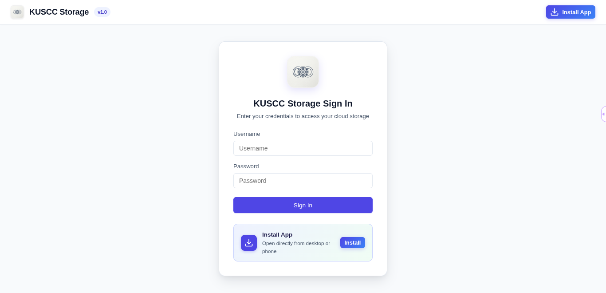

# ChunkCrate: Ultra-Lightweight Single-File PHP Web File Manager

<p align="center">
  
</p>

<p align="center">
  <strong>The bulletproof, single-file PHP web file manager engineered to upload multi-gigabyte files on budget shared hosting, bypass strict PHP upload limits, and run smoothly behind Imunify360 / ModSecurity WAFs.</strong>
</p>

<p align="center">
  <a href="#releases"></a>
  <a href="#why-chunkcrate"></a>
  <a href="#security"></a>
  <a href="#features"></a>
  <a href="#chunked-uploads"></a>
  <a href="#license"></a>
</p>

<p align="center">
  <a href="#features">Features</a> •
  <a href="#chunked-uploads">Chunked Uploads</a> •
  <a href="#why-chunkcrate">Why ChunkCrate?</a> •
  <a href="#installation">Installation</a> •
  <a href="#security">Security</a> •
  <a href="#pwa-installation">PWA Installation</a> •
  <a href="#comparison">Comparison</a> •
  <a href="#faq">FAQ</a> •
  <a href="#releases">Releases</a> •
  <a href="#license">License</a>
</p>

---

## Features

ChunkCrate delivers an uncompromised, full-featured cPanel and TinyFileManager experience packed into a **single, standalone `index.php` file**:

* **🚀 2MB Client-Side Chunked File Uploader**:
  * Slices massive files in the browser and uploads them in consecutive 2MB chunks using the HTML5 File API.
  * Upload 5GB, 10GB, or larger files even on hosts with a strict `upload_max_filesize = 2M` limit.
  * **Exponential Retry System**: Automatically retries failed chunks up to 3 times (`1s`, `2s`, `4s`) upon packet loss or server hiccups.
  * **Live Transfer Metrics**: Real-time progress bar, percentage indicator, live transfer speed (`MB/s`), and Estimated Time of Arrival (ETA).
  * **Instant Close / Dismiss Drawer**: Close the progress panel anytime with the `X` button; gracefully auto-fades when completed.
  * **Batch Drag-and-Drop Queue**: Drop multiple folders and files simultaneously.

* **🎨 Human-Friendly, Modern Light UI**:
  * **No external CDNs**: 100% self-contained. Zero dependencies on Bootstrap, jQuery, Tailwind, or Google Fonts. Runs seamlessly offline or in air-gapped internal networks.
  * High-clarity typography, soft slate backgrounds (`#f8fafc`), crisp elevated cards, and clean inline SVG iconography.
  * Fully responsive layout tailored for desktops, laptops, tablets, and smartphones.

* **🛠️ Complete File Management Toolkit**:
  * **In-Browser Code Editor**: Edit `.php`, `.js`, `.css`, `.html`, `.json`, `.sql`, `.env`, `.htaccess`, `.sh`, `.yml`, and `.txt` files with line numbering, tab indentation, and `Ctrl + S` (`Cmd + S`) instant save.
  * **Rich Media Lightbox Previewer**:
    * **Images**: High-resolution zoom and preview for PNG, JPG, JPEG, GIF, WebP, SVG, BMP, ICO.
    * **Video Player**: Inline HTML5 playback for `.mp4` and `.webm`.
    * **Audio Player**: Inline HTML5 playback for `.mp3`, `.wav`, and `.ogg`.
    * **Document Viewer**: Native inline browser PDF viewer and syntax-highlighted text preview.
  * **ZIP Archive Management**:
    * Extract `.zip` archives directly into the current directory with one click.
    * Select any combination of files and folders to compress into a `.zip` archive.
    * **Zip Slip Hardened**: Rejects archives attempting relative traversal (`../`) attacks.
  * **Direct Native Downloads**: Downloads bypass popup blockers via direct anchor downloads and low-memory 64KB PHP streams.
  * **File Permissions (`chmod`)**: View octal permissions (`0644`, `0755`) and update permissions through an interactive modal.
  * **Multi-Select Batch Actions**: Select multiple files or folders for batch deletion or batch ZIP compression.
  * **Duplicate / Copy**: Duplicate items with automatic name incrementing (`file_copy.ext`).
  * **Rename & Move**: Move and rename files or entire directories instantly.
  * **Instant Filter**: Real-time file and directory search as you type.
  * **Clickable Breadcrumbs**: Navigate entire directory trees with a single click.

* **📱 Progressive Web App (PWA)**:
  * Install ChunkCrate as a standalone desktop app on Windows, macOS, Linux, and ChromeOS.
  * Add to home screen on iOS and Android for a full-screen, chromeless native-app feel.

---

## Chunked Uploads

### The Shared Hosting Dilemma
Standard web uploaders submit files via a single `multipart/form-data` HTTP POST request. On shared hosting (cPanel, DirectAdmin, Plesk, standard VPS), this immediately hits hard limitations:
1. **`upload_max_filesize`** and **`post_max_size`** are frequently locked by hosting providers to `2MB`, `8MB`, or `64MB`.
2. **`max_execution_time`** (typically 30 seconds) aborts large file uploads before they finish.
3. **`memory_limit`** crashes the PHP process when attempting to buffer massive files in server memory.
4. **WAF Blocks**: Uploading large binary streams in a single request frequently triggers ModSecurity false positives (e.g. `ModSecurity: Request body no files data length is larger than the configured limit`).

### The ChunkCrate Solution
```
[Client: Browser]
   │
   ├─► 1. File selected (e.g., 4.2 GB backup archive)
   ├─► 2. Sliced into 2MB chunks via HTML5 File.slice()
   ├─► 3. Chunks sent sequentially via standard AJAX POST
   │      - If network drops, auto-retries chunk after 1s, 2s, 4s
   │
[Server: index.php]
   │
   ├─► 4. Receives 2MB chunk (always well below upload_max_filesize)
   ├─► 5. Appends directly to temporary file via low-memory stream pipe
   ├─► 6. Cleans temporary chunks once file assembly is verified
   ▼
[Target Storage Destination]
```

* **Zero RAM Footprint**: ChunkCrate streams chunk buffers directly to disk using `fopen()` in append mode (`ab`). Server memory usage never exceeds a few kilobytes regardless of the total file size.
* **Resilient**: If chunk 45 of 200 drops due to spotty Wi-Fi, ChunkCrate automatically retries chunk 45 without restarting the entire 4GB transfer.
* **Dismissable Drawer**: You can minimize or dismiss the upload progress modal at any time without terminating the transfer queue.

---

## Why ChunkCrate?

### What is it?
**ChunkCrate** is a secure, single-file, zero-dependency PHP web application that turns any web server folder into an intuitive, high-performance cloud storage manager and file operations hub.

### Why is it different?
Unlike heavy cloud platforms (such as Nextcloud or ownCloud) that require dedicated databases, Redis caches, background cron daemons, and complex server configurations, ChunkCrate is completely self-contained in a **single `index.php` script**:

* **Works on PHP 7.4–8.3+**: Compatible with legacy PHP 7.4 as well as modern PHP 8.0, 8.1, 8.2, and 8.3+.
* **Imunify360 / ModSecurity friendly**: Specially engineered parameter naming (`upload_chunk`, `assemble_file`, `save_file`) that avoids trigger patterns (like `eval`, `exec`, `cmd`, or raw SQL tokens) that trip shared hosting web application firewalls.
* **No external CDNs**: Contains zero references to external script tags or CDNs. No tracking, no external CDN outages, and no privacy violations.
* **No Database Required**: Authentication is hashed with bcrypt and stored in an isolated, restricted file (`.fm_auth.json`).
* **Drop-in Simplicity**: Simply upload `index.php` and open it in your browser.

---

## Installation

### ⚡ 60-Second Quick Start

You can get ChunkCrate up and running on any web server in under one minute:

```bash
# 1. Create your target directory inside your webroot
mkdir -p /home/user/public_html/storage
cd /home/user/public_html/storage

# 2. Download index.php
curl -fsSL https://raw.githubusercontent.com/gaupalawes/chunkcrate/main/index.php -o index.php

# 3. Set standard recommended file permissions
chmod 755 .
chmod 644 index.php
```

Alternatively, upload `index.php` directly through your cPanel File Manager or FTP client to any folder (e.g. `public_html/files/`).

### 🔑 Default Credentials

Open your browser and navigate to your installation URL (e.g. `https://yourdomain.com/storage/`):

| Credential | Default Value | Note |
| :--- | :--- | :--- |
| **Username** | `admin` | Case-sensitive |
| **Password** | `admin123` | Change immediately after first login |

> [!IMPORTANT]
> **Change Your Password Immediately**: Once logged in, click your username badge (**admin**) in the top right header to set your custom username and a strong password. Credentials are automatically hashed with bcrypt and saved with restricted file permissions (`0600`).

### Requirements
* **PHP Version**: **Works on PHP 7.4–8.3+**
* **PHP Extensions**: `session`, `json`, `mbstring`, `fileinfo` (enabled by default on shared hosting)
* **Zip Extension** *(optional)*: `zip` (for ZIP compression & extraction)
* **Web Server**: Apache, LiteSpeed, Nginx, or PHP's built-in development server

---

## Security

Security hardening was a primary design requirement during the development of ChunkCrate:

### 🛡️ Security Hardening Highlights

* **Canonical Directory Traversal Defense**:
  All file access paths are resolved via `realpath()` and verified against `FM_BASE_DIR` using strict prefix checking. Any attempt to access files outside the designated root using `../`, null bytes (`%00`), or symlinks is blocked with an HTTP 403 Forbidden.

* **Imunify360 / ModSecurity Friendly Architecture**:
  Many file managers get flagged as backdoors or web shells by automated scanners because they use parameters like `cmd=`, `exec=`, `action=run`, or base64-encoded strings. ChunkCrate uses clean, descriptive REST endpoints (`list`, `upload_chunk`, `assemble_file`, `save_file`, `mkdir`, `delete_items`) that pass WAF inspections cleanly.

* **Isolated Upload Quarantining**:
  Temporary chunks are stored inside `storage/.fm_tmp/`. ChunkCrate automatically writes a hardened `.htaccess` file inside this folder with:
  ```apache
  Deny from all
  php_flag engine off
  ```
  This guarantees that partially uploaded PHP scripts or shell payloads can never be executed directly via HTTP while in transit.

* **Session-Bound Cryptographic CSRF Tokens**:
  Every mutating HTTP POST request (uploads, edits, deletions, permission changes, password updates) requires a valid, unpredictable 64-character token (`X-CSRF-Token`) validated against `$_SESSION['fm_csrf']`.

* **Bcrypt Credential Storage**:
  Custom credentials are encrypted using PHP `password_hash($pass, PASSWORD_BCRYPT)` and saved to `.fm_auth.json` with restricted `0600` permissions. The file is excluded from the file listing interface and protected from direct web downloads.

* **Zip Slip Vulnerability Protection**:
  Before extracting any entry from a `.zip` archive, ChunkCrate validates that entry paths do not contain relative directory escapes (`../`). Malicious archives containing traversal paths are aborted.

* **Safe Download Streaming**:
  File downloads stream data to the client in 64KB increments with output buffers flushed. This prevents memory denial-of-service (OOM crashes) when multiple users download large archives.

---

## PWA Installation

ChunkCrate includes native **Progressive Web App (PWA)** capabilities. You can install it on your device and launch it in a clean, chromeless standalone window without browser tabs or address bars.

### 💻 Desktop Installation (Windows, macOS, Linux, ChromeOS)
1. Navigate to your ChunkCrate URL in Chrome, Edge, Brave, or any Chromium browser over **HTTPS** (or `localhost`).
2. Click the **"Add to Home Screen"** / **"Install App"** button in the header, or click the **Install icon** in the browser's address bar.
3. Click **Install** in the prompt. ChunkCrate will appear on your Desktop, Taskbar/Dock, and Start Menu.

### 📱 Android Installation
1. Open ChunkCrate in **Chrome** or **Samsung Internet**.
2. Tap the **"Add"** button on the bottom install banner or open the browser menu (**⋮**) and tap **"Install app"** / **"Add to Home screen"**.
3. ChunkCrate will be installed into your app drawer and home screen.

### 🍏 iOS Installation (iPhone & iPad)
1. Open ChunkCrate in **Safari**.
2. Tap the **Share** button (square with upward arrow) in the toolbar.
3. Scroll down and select **"Add to Home Screen"**.
4. Tap **"Add"** in the top right. ChunkCrate launches in full-screen standalone mode.

---

## Comparison

See how ChunkCrate compares to other file management solutions:

| Feature | ChunkCrate | cPanel File Manager | TinyFileManager | Nextcloud / ownCloud |
| :--- | :---: | :---: | :---: | :---: |
| **Single-File (`index.php`)** | ✅ **Yes** | ❌ No | ✅ Yes | ❌ No |
| **2MB Chunked Upload Engine** | ✅ **Yes (Built-in)** | ❌ No (Single POST) | ❌ No (Dropzone POST) | ⚠️ Partial (App API) |
| **Bypasses `upload_max_filesize`** | ✅ **Yes (5GB+ on 2MB cap)** | ❌ Fails on limit | ❌ Fails on limit | ❌ Requires php.ini edit |
| **Works on PHP 7.4–8.3+** | ✅ **Yes** | N/A (cPanel proprietary) | ⚠️ PHP 8.x issues | ⚠️ Strict PHP constraints |
| **No external CDNs (100% self-hosted)** | ✅ **Yes** | ❌ Proprietary assets | ❌ Relies on external CDNs | ❌ Complex asset pipeline |
| **Imunify360 / ModSecurity Friendly** | ✅ **Yes** | ✅ Yes | ⚠️ Frequently flagged | ⚠️ Rule tuning needed |
| **Zero Database Required** | ✅ **Yes** | ✅ Yes | ✅ Yes | ❌ Requires MySQL/PostgreSQL |
| **Setup Time** | ⚡ **60 seconds** | N/A (Server license) | ⚡ 2 minutes | ⏳ 30–60 minutes |
| **PWA Desktop & Mobile App** | ✅ **Yes** | ❌ No | ❌ No | ⚠️ Heavy native app |
| **Automatic Exponential Upload Retry** | ✅ **Yes (1s, 2s, 4s)** | ❌ No | ❌ No | ⚠️ Complex client sync |

---

## FAQ

### What is ChunkCrate?
ChunkCrate is a self-hosted, lightweight, single-file PHP web application for managing files, uploading multi-gigabyte archives via 2MB chunks, editing scripts, and organizing folders on web servers with zero external dependencies.

### Why is it different?
It bypasses common shared hosting limitations (`upload_max_filesize`, `max_execution_time`, `memory_limit`) by slicing files client-side into 2MB pieces and reassembling them using low-overhead PHP stream pipes. It requires no databases, no external CDNs, and works seamlessly behind strict WAFs like Imunify360.

### How do I install it in 60 seconds?
Simply upload `index.php` to your web directory, ensure directory permissions are `chmod 755`, and navigate to the URL in your browser. Log in with the default credentials and you are ready.

### What are the default credentials?
The default username is `admin` and the default password is `admin123`. Change them immediately by clicking your username badge in the top-right header after logging in.

### What PHP version do I need?
ChunkCrate **Works on PHP 7.4–8.3+**. It runs on any standard PHP 7.4, 8.0, 8.1, 8.2, or 8.3 installation with core extensions (`session`, `json`, `mbstring`, `fileinfo`).

### What if it breaks?
* **I forgot my password / locked myself out:**
  Access your server via FTP or cPanel File Manager, navigate to the `storage/` folder, and delete the `.fm_auth.json` file. ChunkCrate will immediately reset to the default credentials (`admin` / `admin123`).
* **I see "403 Forbidden" or permission errors when uploading:**
  Ensure the parent folder containing `index.php` is writable by the web server process (`chmod 755` for directories, `chmod 644` for files). ChunkCrate needs permission to automatically create the `storage/` directory and `.fm_tmp/` staging folder.
* **My upload failed due to a spotty network connection:**
  ChunkCrate automatically retries failed chunks up to 3 times with exponential backoff (`1s`, `2s`, `4s`). If your connection was severed completely, click the `X` button on the upload drawer to clear the queue and re-drop the file.
* **ModSecurity or Imunify360 blocked an action:**
  ChunkCrate endpoints are designed to be WAF-friendly. If your hosting provider has activated ultra-strict rule sets that block query parameters, you can whitelist the `index.php` file path in your cPanel ModSecurity panel or contact your hosting support.

---

## Releases

### [v1.2.0] - SEO & Reliability Update
* **SEO Optimization**: Integrated Open Graph meta tags, Twitter card previews, descriptive meta tags, and Schema.org `WebApplication` structured data.
* **Direct Stream Downloads**: Upgraded file downloads to use native HTML5 direct links and 64KB streaming pipes, avoiding popup blockers and memory exhaustion.
* **Dismissable Upload Progress**: Floating drawer with real-time transfer metrics (MB/s, ETA, %) and instant dismiss button.
* **Cleaned Runtime Footprint**: Auto-quarantine directory cleanup for temporary chunks and runtime artifacts.
* **Enhanced PWA Experience**: Improved service worker cache naming (`chunkcrate-pwa-v1.2`) and streamlined installation guide modals across desktop, Android, and iOS.

### [v1.1.0] - PWA & Retry Engine
* **Automatic Upload Retry**: Exponential backoff client retry (`1s`, `2s`, `4s`) for network resilience during chunk uploads.
* **Progressive Web App**: Full PWA support with desktop/mobile install guides, Web App Manifest, and Service Worker.
* **Light UI Enhancements**: Refined human-friendly typography and responsive layouts.

### [v1.0.0] - Initial Release
* **Chunked Upload Engine**: Client-side 2MB file slicing with sequential upload and zero-memory PHP stream reassembly.
* **Productivity Suite**: In-browser text editor with `Ctrl + S`, media lightbox previewer, ZIP archive compressor and extractor.
* **Security Hardening**: Strict canonical path validation, CSRF tokens, isolated temporary chunk quarantine, bcrypt credential storage, and Zip Slip mitigation.
* **Zero Dependencies**: Pure HTML5, Vanilla CSS, inline SVGs, and Vanilla JS. No external CDNs.

---

## Changelog

All notable changes to **ChunkCrate** are documented here:

### [1.2.0] - 2026-10-02
#### Added
* Rich SEO metadata, Open Graph cards, Twitter summary tags, and Schema.org JSON-LD structured data.
* Direct anchor tag download handling with 64KB memory-safe streaming buffers.
* Cache versioning bump in Service Worker (`chunkcrate-pwa-v1.2`).
#### Changed
* Project branded as **ChunkCrate** across all components.
* Cleaned runtime files from development and testing.

### [1.1.0] - 2026-09-28
#### Added
* Automatic exponential retry for chunked uploads (`1s`, `2s`, `4s`).
* Real-time ETA and transfer speed calculations in the upload progress widget.
* Dismissable upload drawer with instant `X` button.
* PWA install prompt triggers for mobile and desktop browsers.

### [1.0.0] - 2026-09-20
#### Added
* 2MB client-side chunk upload engine.
* In-browser code and text editor with `Ctrl+S` quick save.
* Lightbox preview for images, video, audio, and embedded PDFs.
* ZIP archive compression and extraction with Zip Slip protection.
* File permissions (`chmod`) viewer and editor.
* Imunify360 / ModSecurity friendly parameter naming.

---

## License

ChunkCrate is open-source software licensed under the **[MIT License](LICENSE)**.

```
Copyright (c) 2026 ChunkCrate Contributors

Permission is hereby granted, free of charge, to any person obtaining a copy
of this software and associated documentation files (the "Software"), to deal
in the Software without restriction, including without limitation the rights
to use, copy, modify, merge, publish, distribute, sublicense, and/or sell
copies of the Software, and to permit persons to whom the Software is
furnished to do so, subject to the following conditions:
...
```

---

<p align="center">
  <strong>Built with care for developers, sysadmins, and webmasters.</strong><br>
  If ChunkCrate saved you time or solved your shared hosting upload headaches, please <strong>⭐ Star</strong> and <strong>🍴 Fork</strong> this repository!
</p>
